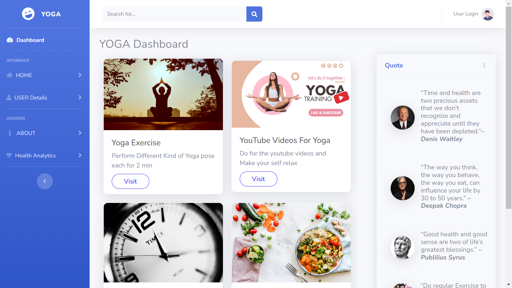
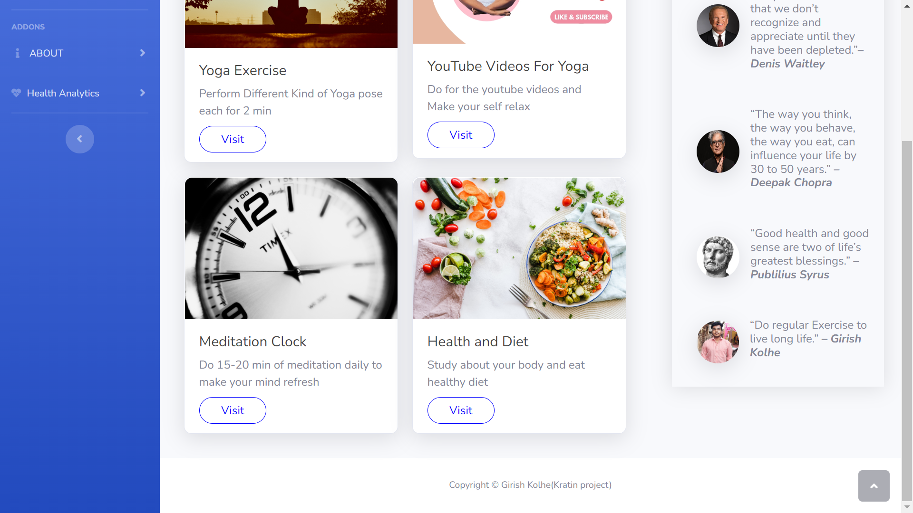
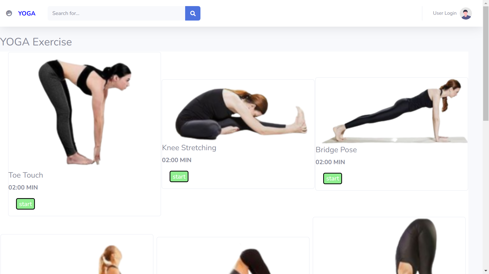
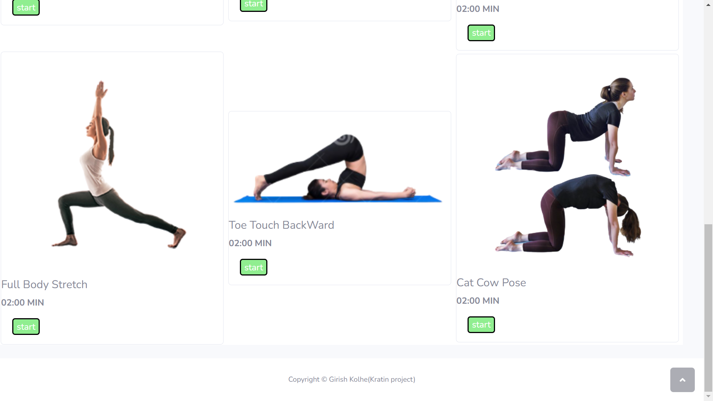
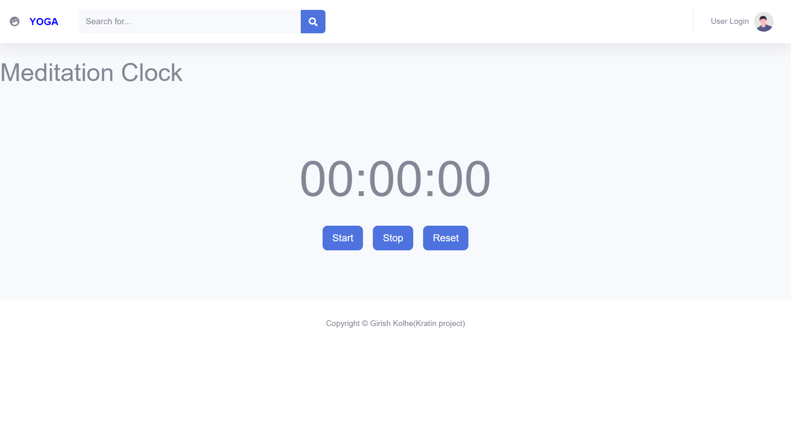
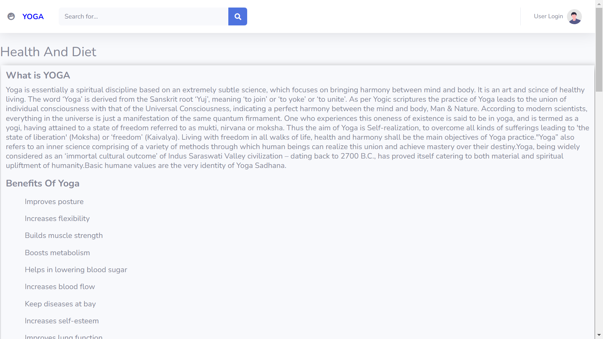

# YOGA_APP_GK

It is the Basic Yoga app Which contains different types of Yoga poses for elderly people and also contain Youtube videos which help and guide the senior citizen and will make there life healthy and long.
The idea behind this project is to make the life of senior citizens easy and healthy.It will help and guide them how to live Healthy life by following good diet plan and doing regular yoga will surely make there life longer.

Features of App:
1. Yoga exercises Time based
2. Videos on Yoga
3. Timer clock fro mediation
4. Health and Diet tips

ScreenShots:

